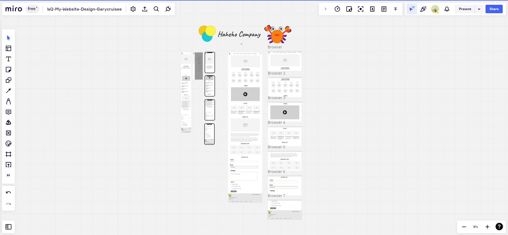
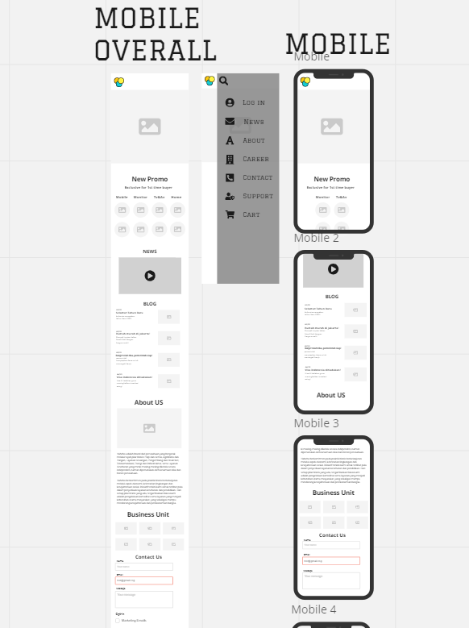
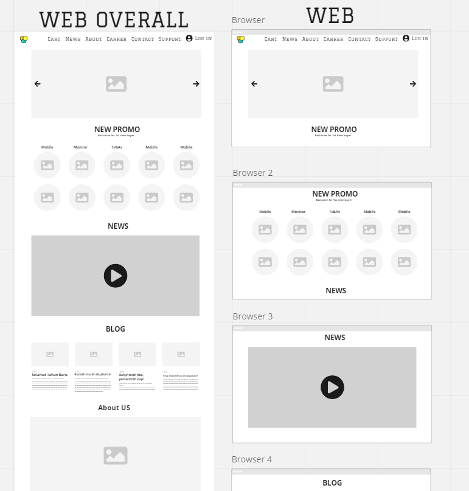
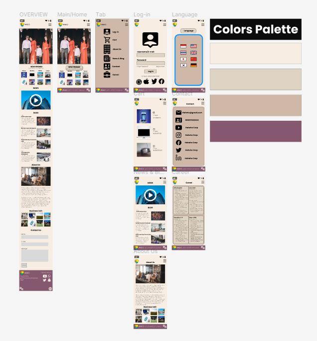
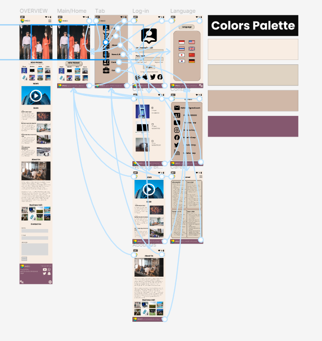

# My Website Design

> Week 2 assignment for **My Website Design**

## Description

This is a single-person project by FSSE RevoU designed for us to make our Website Design,

Using both **_Miro_** and **_Figma_**.

The focus of this project is to make **_Wireframe_**, **_Mockup_** & **_Prototype_**.

That will enable us to see **the layout of a web page** that demonstrates what interface elements **will exist** on key pages,

And to provide a **Visual Understanding** of a page early to ensure the terminology and structure used for the site meet user expectations.

## Project Link & Screenshot

### Miro

#### Link

https://miro.com/app/board/uXjVPumK6HM=/?share_link_id=680901365682

#### Screenshot

### Figma

#### Link

https://www.figma.com/file/oYPnSll7tFuf3AQq38Eco9/W2-My-Website-Design-Garycruisee?node-id=0%3A1&t=AnGGK5NbJYF5YZ5v-1

#### Screenshot

## Sources

| Color & Photo                      | Used for      |
| :--------------------------------- | :------------ |
| [Colorhunt](https://colorhunt.co/) | Color Palette |
| [Unsplash](https://unsplash.com/)  | Images Source |

| References                                             |
| :----------------------------------------------------- |
| [Samsung](https://www.samsung.com/id/)                 |
| [Sinarmas](https://www.sinarmas.com/)                  |
| [Tokopedia](https://www.tokopedia.com/)                |
| [GenshinImpact](https://genshin.hoyoverse.com/en/home) |

| Color       | Code    |
| :---------- | :------ |
| Merino      | #F8EDE3 |
| Oyster Pink | #DFD3C3 |
| Clam Shell  | #D0B8A8 |
| Falcon      | #85586F |
